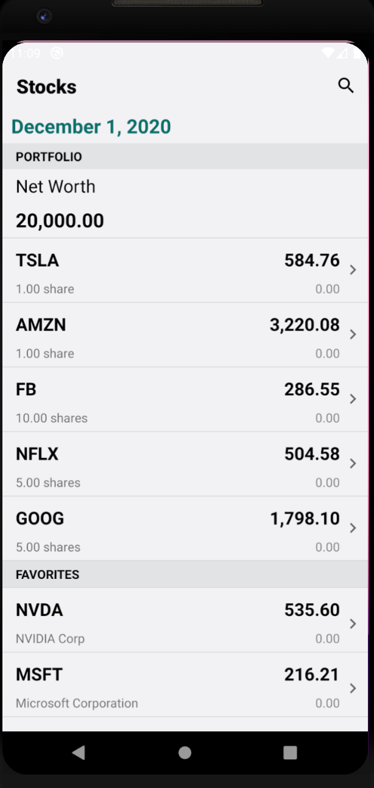
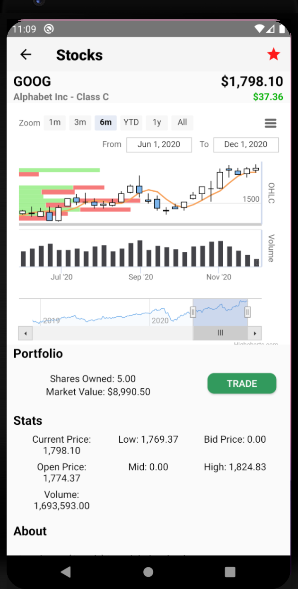
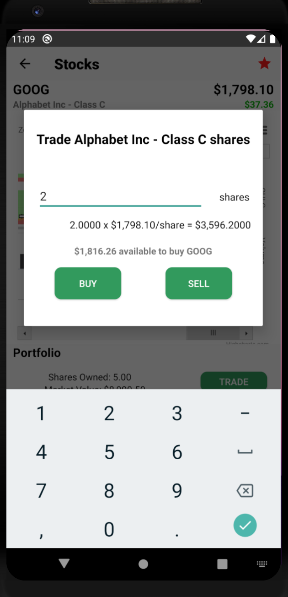
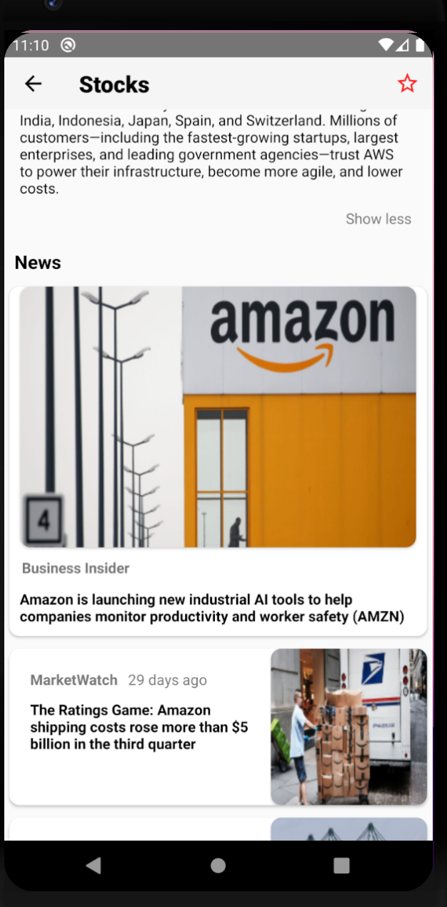
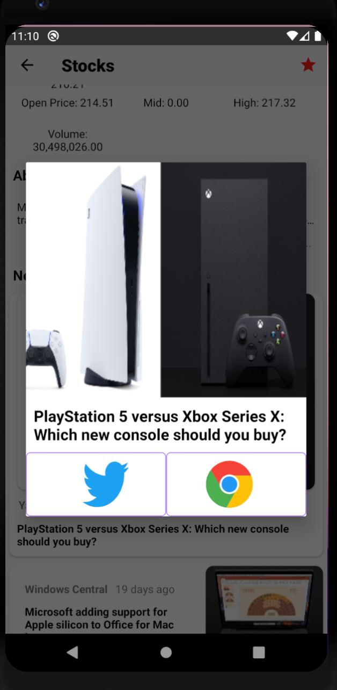
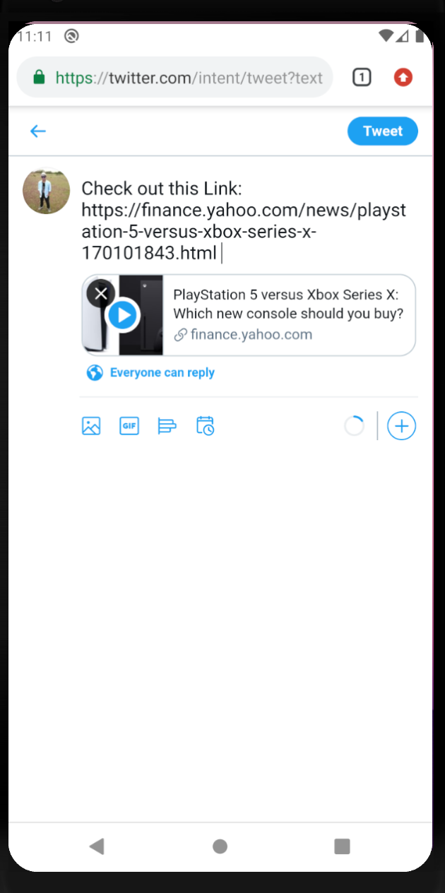
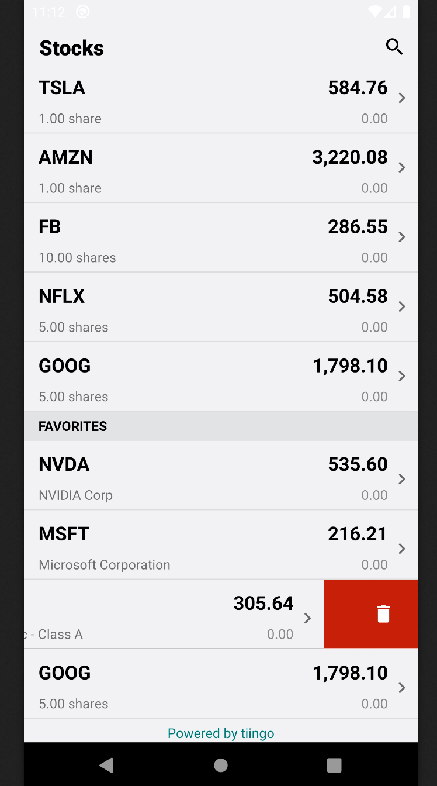
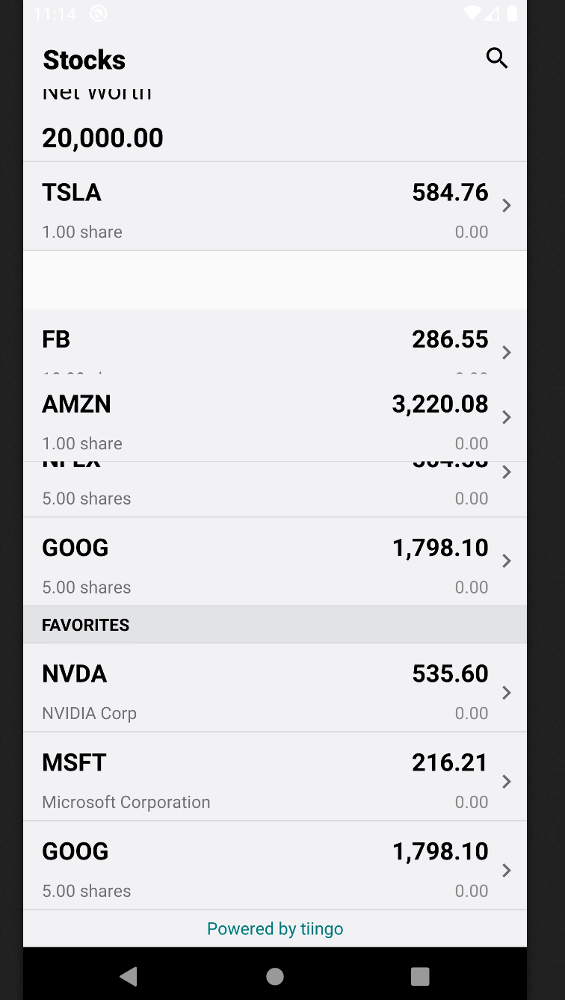
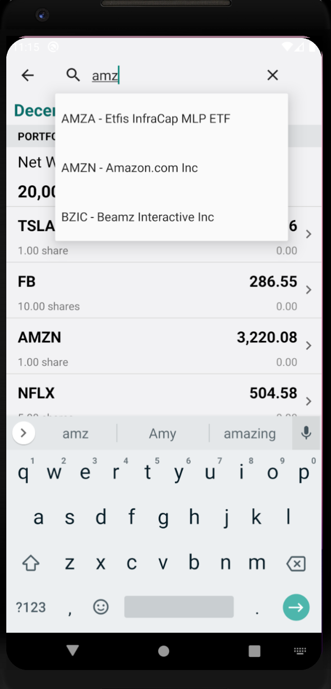

# Node and Android based Stock application (Google Cloud)

A native android mobile app developed as part of CSCI 571 - Web Technologies @ USC. This repository only contains the source code for Android frontend. The Node javascript backend is present here: https://github.com/adityachandupatla/android-node-backend

<h2>Project Goals</h2>
<ul>
  <li>Become familiar with Java, JSON, <a href="https://developer.android.com/guide/components/activities/activity-lifecycle">Android Lifecycle</a> and <a href="https://developer.android.com/studio">Android Studio</a> for <a href="https://www.android.com/">Android app development</a></li>
  <li>Build a good-looking Android app</li>
  <li>Learn the essentials of Google’s Material design rules for designing Android apps</li>
  <li>Learn to use the tiingo APIs and the Android SDK</li>
  <li>Get familiar with third party libraries like <a href="https://square.github.io/picasso/">Picasso</a>, and <a href="https://developer.android.com/training/volley">Volley</a></li>
  <li>Understand the flexible <a href="https://gradle.org/">Gradle</a> - based build system</li>
  <li>Define commonly used <a href="https://developer.android.com/guide/topics/ui/declaring-layout">layouts</a> for building the UI</li>
  <li>Implement <a href="https://developer.android.com/reference/android/widget/AutoCompleteTextView">Autocomplete</a> feature for searching stock tickers</li>
  <li>Implement <a href="https://developer.android.com/reference/androidx/recyclerview/widget/ItemTouchHelper">swipe and drag</a> feature, and move items in a recyclerview</li>
  <li>Use <a href="https://developer.android.com/reference/android/webkit/WebView">webview</a> to run javascript inside mobile</li>
</ul>

<h2>Screenshots of the developed app</h2>
<table>
  <tr>
    <td>
      
<b>Home screen</b>

      
    </td>
    <td>
      
<b>Details screen</b>

      
    </td>
    <td>
      
<b>Trade screen</b>

      
    </td>
  </tr>
  <tr>
    <td>
      
<b>News screen</b>

      
    </td>
    <td>
      
<b>Share screen</b>

      
    </td>
    <td>
      
<b>Twitter screen</b>

      
    </td>
  </tr>
  <tr>
    <td>
      
<b>Chrome screen</b>

      
    </td>
    <td>
      
<b>Delete screen</b>

      
    </td>
    <td>
      
<b>Reorder screen</b>

      
    </td>
  </tr>
  <tr>
    <td>
      
<b>Search screen</b>

      </td>
  </tr>
</table>

